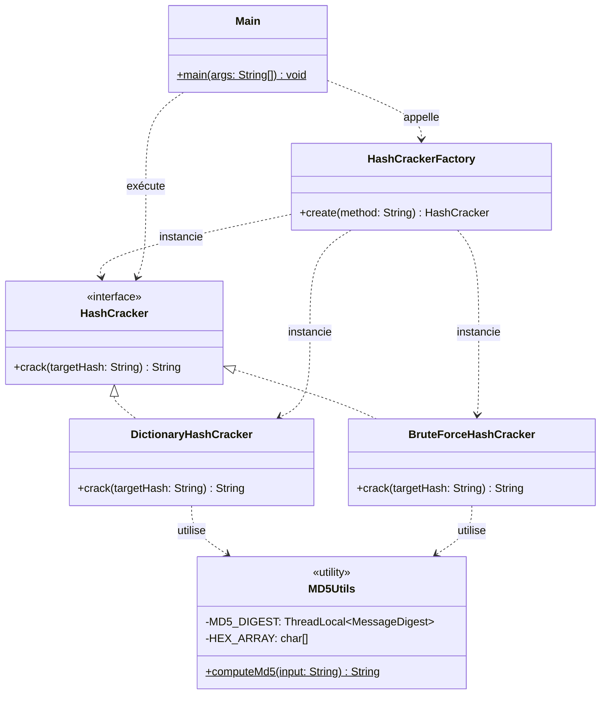

# Architecture du Projet PasswordCracker v1

## 1. Vue d'ensemble

**PasswordCracker** est un outil en ligne de commande (CLI) développé en Java (version 17+). Son objectif est de retrouver un mot de passe en clair à partir de son empreinte (hash) MD5, en utilisant différentes stratégies de recherche.

L'architecture du projet a été pensée pour être **modulaire, performante et sans état (stateless)**, en appliquant les principes de conception SOLID et des Design Patterns classiques.

---

## 2. Design Patterns Utilisés

L'architecture repose principalement sur deux patrons de conception (Design Patterns) :

1. **Strategy (Stratégie)** : 
   Permet d'isoler les différents algorithmes de cassage de mots de passe (`Dictionary` vs `BruteForce`) derrière une interface commune (`HashCracker`). Le programme peut ainsi interchanger la méthode de recherche dynamiquement sans modifier le code client.
2. **Simple Factory (Fabrique Simple)** :
   Centralise la logique d'instanciation des différentes stratégies en fonction d'un paramètre utilisateur (`"DICO"` ou `"BRUTE"`), simplifiant ainsi le rôle du point d'entrée (`Main`).

---

## 3. Structure des Packages

Le code est organisé par responsabilités dans le package racine `com.passwordcracker` :

| Package | Classes | Responsabilité |
| :--- | :--- | :--- |
| **`.core`** | `HashCracker`, `MD5Utils` | **Le cœur du moteur.** Contient le contrat (interface) et les utilitaires fondamentaux (hashage ultra-optimisé). |
| **`.strategy`** | `DictionaryHashCracker`, `BruteForceHashCracker` | **Les algorithmes.** Les implémentations concrètes de l'interface `HashCracker` (Dictionnaire et Force Brute). |
| **`.factory`** | `HashCrackerFactory` | **L'instanciation.** Fabrique responsable de fournir la bonne stratégie selon les arguments. |
| **`.cli`** | `Main` | **Le point d'entrée.** Parse les arguments utilisateurs, chronomètre l'exécution et affiche le résultat. |

---

## 4. Diagramme de Classes (UML)

---

## 5. Flux d'Exécution (Runtime Flow)

1. L'utilisateur lance le programme via le terminal (`Main`) avec des arguments (ex: `-m DICO -h 098f6bcd4621d373cade4e832627b4f6`).
2. `Main` délègue l'analyse de la méthode (`-m DICO`) à la `HashCrackerFactory`.
3. `HashCrackerFactory` retourne une instance de `DictionaryHashCracker`.
4. `Main` appelle la méthode `crack(hash)` sur l'instance reçue (polymorphisme).
5. La stratégie exécute son algorithme, s'appuyant de manière intensive sur la méthode très performante `MD5Utils.computeMd5()`.
6. Si une correspondance est trouvée, le mot de passe original est renvoyé à `Main`, sinon `null` est retourné.
7. `Main` affiche le résultat avec le chronométrage global.

---

## 6. Décisions Architectures Spécifiques (Aliou Loum)

* **Zéro Dépendance Lourde** : Pas de bibliothèques tierces comme Apache Commons Codec ou Guava pour le MD5. L'implémentation est native, convertit les bits vers l'Hexadécimal à la main, réduisant drastiquement l'empreinte mémoire et améliorant la vitesse.
* **Thread-Safety Optimisée** : La classe `MD5Utils` utilise un `ThreadLocal<MessageDigest>` plutôt qu'une recréation d'instance ou qu'un verrou (`synchronized`). Cela assure des performances maximales si, à l'avenir, le traitement de force brute venait à être parallélisé.
* **Contrats stricts** : Toutes les stratégies obéissent à l'unique méthode simple et lisible `String crack(String targetHash)`.
