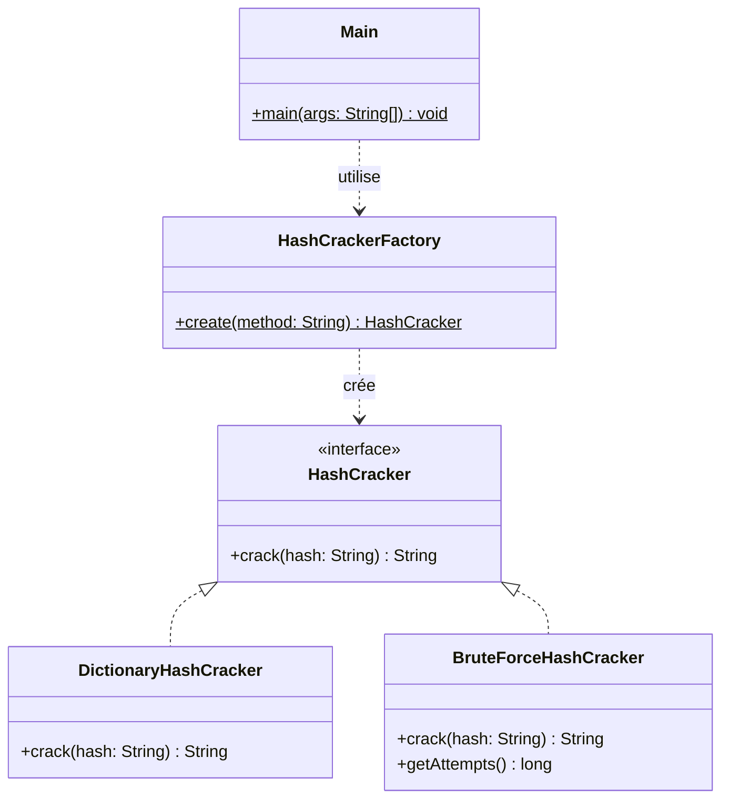

# PasswordCracker v1

Outil en ligne de commande permettant de retrouver un mot de passe à partir de son hash MD5, en utilisant le patron de conception **Simple Factory**.

## 1. Introduction

PasswordCracker est un outil développé en Java dans un cadre pédagogique de sécurité informatique. Il permet, à partir d'un hash MD5, de retrouver le mot de passe en clair en testant deux stratégies : la recherche par dictionnaire et la recherche par force brute.

## 2. Présentation du problème

Dans une base de données, les mots de passe ne sont jamais stockés en clair : ils sont hachés via une fonction cryptographique comme MD5. Lors d'un audit de sécurité, il est utile de pouvoir tester la robustesse des mots de passe en tentant de retrouver leur valeur d'origine à partir de leur empreinte. PasswordCracker automatise cette démarche via deux approches complémentaires.

## 3. Architecture

Le projet est organisé en 4 packages, correspondant chacun à une responsabilité claire :

| Package | Rôle |
|---|---|
| `com.passwordcracker.core` | Interface `HashCracker` + utilitaire `MD5Utils` |
| `com.passwordcracker.strategy` | Stratégies concrètes `DictionaryHashCracker` et `BruteForceHashCracker` |
| `com.passwordcracker.factory` | Fabrique `HashCrackerFactory` |
| `com.passwordcracker.cli` | Point d'entrée `Main` |

Chaque stratégie implémente l'interface commune `HashCracker`, ce qui permet au reste de l'application de manipuler n'importe quelle stratégie de façon polymorphe, sans connaître son implémentation concrète.

## 4. Diagramme UML



## 5. Usage du patron Simple Factory

La création des objets `DictionaryHashCracker` et `BruteForceHashCracker` est centralisée dans `HashCrackerFactory.create(String method)`. La classe `Main` ne connaît jamais les classes concrètes : elle demande simplement une instance de `HashCracker` à la fabrique via le paramètre `-m` (`DICO` ou `BRUTE`). Cela évite toute instanciation directe dans le code client et respecte la contrainte du sujet.

```java
HashCracker cracker = HashCrackerFactory.create("DICO");
String password = cracker.crack(hash);
```

## 6. Résultats obtenus

> **Note** : le hash d'exemple fourni dans l'énoncé (`e7247759c1633c0f9f1485f3690294a9`) ne correspond en réalité pas au MD5 de "test". Nous l'avons vérifié avec `echo -n "test" | md5sum`, qui donne `098f6bcd4621d373cade4e832627b4f6`. Nous avons utilisé ce hash correct pour valider l'application.

```
$ java -cp target/classes com.passwordcracker.cli.Main -m DICO -h 098f6bcd4621d373cade4e832627b4f6
Password found: test
Temps d'exécution : 94 ms

$ java -cp target/classes com.passwordcracker.cli.Main -m BRUTE -h 098f6bcd4621d373cade4e832627b4f6
Password found: test
Temps d'exécution : 456 ms
Nombre de tentatives : 355414
```

Vidéo de démonstration : *[lien à insérer, max 10 minutes]*

## 7. Difficultés rencontrées

- Le hash d'exemple fourni dans l'énoncé ne correspondait pas au mot "test" attendu ; nous avons recalculé le hash réel pour valider nos tests plutôt que de nous fier aveuglément à l'énoncé.
- Générer efficacement toutes les combinaisons de 1 à 4 caractères en force brute sans explosion du temps d'exécution.
- Garantir que chaque personne puisse travailler sans bloquer les autres : résolu par une organisation séquentielle avec livrables clairs à chaque étape (voir répartition des tâches).
- Centraliser la création des objets dans la fabrique sans dupliquer de logique entre les stratégies.

## 8. Conclusion

Ce mini-projet a permis de mettre en pratique le patron Simple Factory dans un contexte concret : centraliser la création d'objets polymorphes tout en gardant le code client découplé des implémentations concrètes. La limite principale de cette approche est qu'ajouter une nouvelle stratégie nécessite de modifier la fabrique elle-même, ce qui viole le principe Open/Closed — point qui sera corrigé dans le mini-projet suivant.

---

### Questions de réflexion

1. **Avantages de la fabrique simple** : centralise la création d'objets, découple le client des classes concrètes, simplifie la maintenance du point de création.
2. **Inconvénients** : viole le principe Open/Closed (il faut modifier la fabrique pour ajouter un cas), logique de création concentrée dans une seule classe qui peut grossir.
3. **Ajout d'une nouvelle stratégie** : il faut modifier `HashCrackerFactory.create()` pour ajouter un nouveau `case`, en plus de créer la nouvelle classe.
4. **Respect du principe Open/Closed** : non, car la fabrique doit être modifiée (et non simplement étendue) à chaque nouvelle stratégie.
